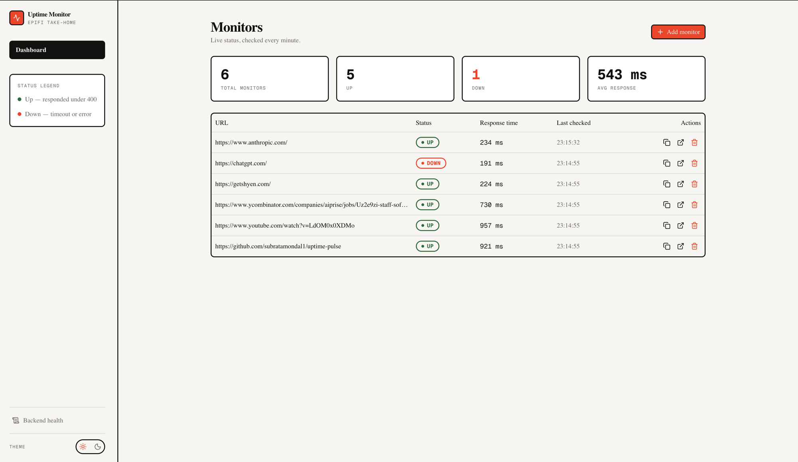
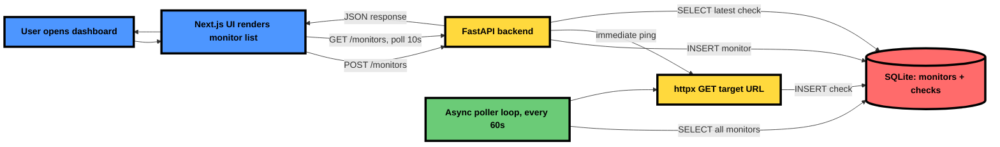
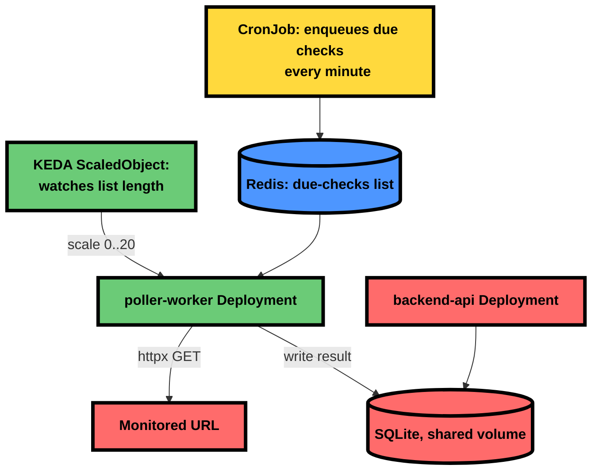

<div align="center">

# Epifi Uptime Monitor

Lightweight uptime monitor. FastAPI backend pings registered URLs on an interval, stores status/response-time/timestamp in SQLite; Next.js frontend shows live status.

**Backend**


**Frontend**


**Infra**


</div>



## Architecture



## Quickstart

```bash
docker compose up --build
```

- Frontend: http://localhost:3000
- Backend: http://localhost:8000

## Testing up/down detection

1. Open http://localhost:3000
2. Add monitor `https://example.com` — shows **UP** within a few seconds
3. Add monitor `https://this-domain-does-not-exist-abc123.invalid` — shows **DOWN**
4. Status refreshes automatically every 10s on the dashboard; backend re-pings every 60s

## Stack

**Backend**
- FastAPI, Python 3.11
- SQLite via `aiosqlite` (right-sized for this scale — see `career`/architecture notes on when this would change)
- `httpx` for outbound pings, `redis` for the queue-based worker path
- Pydantic Settings, structlog (colored console in dev, JSON in prod)
- `uv` (dependency management), `ruff` (lint/format), `ty` (type checking), `pytest` (tests)

**Frontend**
- Next.js 16 (App Router, Turbopack), Bun
- Tailwind CSS 4, shadcn/ui (Radix primitives), next-themes (light/dark)
- Biome (lint/format), `tsc` (type checking)

**Infra**
- Both Docker images: distroless, non-root, multi-stage builds
- `docker-compose.yml` for local orchestration
- `k8s/` — Kubernetes + KEDA autoscaling (bonus layer, see "Scaling this to production" below)

**DevOps**
- `lefthook` pre-commit hook — ruff format/lint + ty (backend), Biome + tsc (frontend), scoped to staged files only
- `lefthook` pre-push hook — runs the full `make ci` gate (lint + typecheck + `pytest` + frontend build) before any push is allowed
- GitHub Actions (`.github/workflows/ci.yml`) — same gate, enforced on every push/PR, both stacks as separate jobs
- `make ci` runs the identical gate locally, on demand

## Deployment sketch

See [`infra/deployment-sketch.md`](infra/deployment-sketch.md).

## AI collaboration log

See [`AI_LOG.md`](AI_LOG.md).

---

## Scaling this to production: Kubernetes + KEDA (`k8s/`)

The MVP above satisfies the brief as scoped. This section documents how the same codebase extends to a
real, autoscaled deployment — a separate, additive path (`k8s/`) alongside `docker-compose.yml`, not a
replacement for it.

### Why the poller needs a different shape at scale

A single in-process `asyncio` loop (`backend/src/monitors/poller.py`) works for a few dozen URLs. Past that,
the check workload needs to be a horizontally scaled fleet, decoupled from the API process. `k8s/` adds:

- `backend/src/worker/scheduler.py` — enqueues due checks onto a Redis list (`due-checks`), run as a
  Kubernetes `CronJob` every minute
- `backend/src/worker/consumer.py` — pops jobs from that list, pings the target, writes the result; this is
  the component KEDA scales
- The original in-process poller is disabled in this mode via `UPTIME_ENABLE_INPROCESS_POLLER=false`, so the
  two paths never double-ping the same monitor

### Architecture



### Running it locally

```bash
kind create cluster --config k8s/kind-config.yaml
helm install keda kedacore/keda --namespace keda --create-namespace
docker build -t epifi-uptime-monitor-backend:latest ./backend
kind load docker-image epifi-uptime-monitor-backend:latest --name uptime-platform
kubectl apply -f k8s/namespace.yaml
kubectl apply -f k8s/redis.yaml -f k8s/backend-api.yaml -f k8s/worker-deployment.yaml -f k8s/scheduler-cronjob.yaml -f k8s/keda-scaledobject.yaml
```

Or simply `make k8s-up` — same steps, wrapped with automatic retry on transient network failures.

Watch it scale, live:

```bash
kubectl get scaledobject,hpa -n uptime-platform
kubectl get pods -n uptime-platform -w
```

### Measured, on this machine (MacBook Pro, M1 Max, 32GB, 10-core)

Not a simulation — captured from an actual run against this exact deployment, 15 monitors registered, Colima
VM sized at 8 vCPU / 16GiB:

| Event | Observed |
|---|---|
| `poller-worker` at rest | 0 replicas (KEDA `minReplicaCount: 0`) |
| Queue filled (15 jobs enqueued by the CronJob) | KEDA scaled 0→3 pods within ~10s |
| Queue drained (15 jobs → 0) | ~20-25s across 3 pods, external-target-latency-bound |
| Idle after drain | scaled back to 0 after the 30s `cooldownPeriod` |
| Next scheduler tick (new jobs enqueued) | scaled back up within ~10s — the cycle repeats correctly |

Local CPU-bound pod ceiling on this machine's Colima allocation (50m CPU request per worker pod, 7 usable
vCPU after system reserve): **~140 pods** — the `ScaledObject`'s `maxReplicaCount: 20` here is a deliberately
conservative local demo value, not that ceiling.

**One real bug this surfaced**: an initial clean run of the above cycle happened to not trigger it, but a
repeat adversarial pass under rapid, back-to-back enqueue load found `poller-worker` pods crash-looping on a
Redis `BLPOP` client-timeout race (see `AI_LOG.md`'s third course-correction). Fixed and re-verified — three
rapid stress rounds afterward, **zero restarts**.

**What this does and doesn't prove**: it proves the scaling *mechanism* — KEDA reacting to real queue depth,
0→N→0, correctly and repeatably. It does not prove cloud-scale throughput, multi-AZ failure isolation, or
node-level autoscaling (Karpenter) — a single-node local cluster has no equivalent for any of those, and the
network path (this machine's own connection) is not representative of a cloud egress path either. The
honest claim is exactly what was measured, nothing more.
