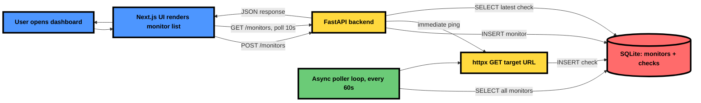

# Epifi Uptime Monitor

Lightweight uptime monitor. FastAPI backend pings registered URLs on an interval, stores status/response-time/timestamp in SQLite; Next.js frontend shows live status.

## Architecture



## Setup

```
docker compose up --build
```

- Frontend: http://localhost:3000
- Backend: http://localhost:8000

## Testing up/down detection

1. Open http://localhost:3000
2. Add monitor `https://example.com` — shows **UP** within a few seconds
3. Add monitor `https://this-domain-does-not-exist-abc123.invalid` — shows **DOWN**
4. Status refreshes automatically every 10s on the dashboard; backend re-pings every 60s

## Stack

- **Backend**: FastAPI, SQLite (`aiosqlite`), `httpx`, `uv`/`ruff`/`ty`
- **Frontend**: Next.js 16, Bun, Biome, Tailwind 4, shadcn/ui, next-themes
- **Docker**: both images distroless, non-root, multi-stage

## Deployment sketch

See [`infra/deployment-sketch.md`](infra/deployment-sketch.md).

## AI collaboration log

See [`AI_LOG.md`](AI_LOG.md).
